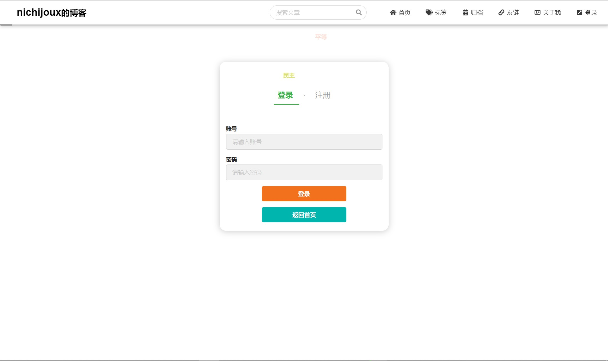

# Blog（个人博客项目）

## 项目介绍

`Blog`是一个基于`spring boot`和`vue2`的前后端分离项目，前台使用`semanticUI`可自适应展示内容。

## 项目演示

### 前台系统

#### 首页

#### 登录/注册

### 标签页

#### 博客详情页

#### 评论区

#### 友链页

#### 归档页

### 后台系统

## 技术选型

### 后端技术

|      技术      |     说明     |
| :------------: | :----------: |
|   SpringBoot   | 容器+MVC框架 |
| SpringSecurity |   安全框架   |
|  MyBatis-Plus  |   ORM框架    |
|     Redis      |     缓存     |
|      OSS       |  对象云存储  |
|   SpringMail   | 邮件发送服务 |

### 前端技术

|         技术         |       说明        |
| :------------------: | :---------------: |
|         Vue2         |     前端框架      |
|      ElementUI       |    后台UI框架     |
|      thymeleaf       |   邮件模板引擎    |
|        axios         |    网络请求库     |
|     semantic-ui      |    前台UI框架     |
| markdown-it-mathjax3 | 前台markdown渲染a |

## 环境搭建

- 创建数据库 `blog` ，并运行`blog.sql`
- 修改后端`application.properties`，配置阿里云oss和spring.mail

